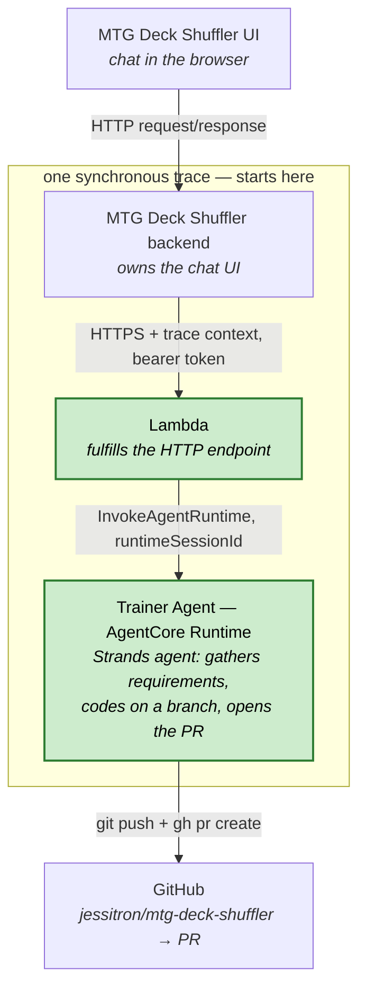

# small-coding-agent

A single-purpose coding agent on **Amazon Bedrock AgentCore Runtime**. It chats
with a human, implements a coding task on `jessitron/mtg-deck-shuffler`, and
opens a PR.

See [`design/architecture.md`](design/architecture.md) for the full design and
the invoke contract.

## The interface — [`INTERFACE.md`](INTERFACE.md)

[`INTERFACE.md`](INTERFACE.md) is **the single file a consumer repo copies in** to
learn how to work with this project. It is the canonical interface spec and it
defines **three** interfaces, not just the endpoint:

- **Conceptual** — what the Trainer Agent is *for*, so an agent on the other side
  can reason about what we're building together.
- **Collaboration** — how to request changes to the Trainer Agent itself, by
  filing development requests in Linear (team `jessitron`, project
  `small-coding-agent`).
- **Technical** — the HTTP wire contract: endpoint, auth, request/response,
  versioning, the local stub.

**Process / conventions:**

- **Consumers pin by copying `INTERFACE.md`** into their own repo; their git
  history then records the version they integrate against.
- **Contract changes are a Linear request, not a local edit.** When a consumer
  needs the interface to change, they file in the shared `jessitron` team — they
  don't edit their copy or open a PR here. The two sibling repos
  (`small-coding-agent` and `mtg-deck-shuffler`) file issues for each other this
  way.
- **The version covers expectations, not just the wire bytes.** A change to what a
  consumer should *expect* — conceptual, collaboration, or technical — is a version
  bump (MAJOR if it could confuse/break someone on the old version, MINOR for a
  non-invalidating addition). The doc and the running service bump together (the
  service advertises `X-Trainer-Agent-Interface-Version`); keep them in lockstep.

When the technical contract or these conventions change, update `INTERFACE.md` —
it is the source of truth that everything downstream copies from.

## Architecture

> 🟩 Green nodes (**Lambda** and **Trainer Agent**) are what lives in this repo.
> The rest are external systems we talk to.
>
> ⛓️ The whole path is synchronous request/response and joins **one trace** that
> starts in the backend; trace context propagates down each hop to the agent.

| Hop | How |
| --- | --- |
| UI → backend | HTTP request/response; the backend owns the chat UI. |
| backend → Lambda | HTTPS to an endpoint fulfilled by a Lambda, authenticated with a bearer token. |
| Lambda → Trainer Agent | `InvokeAgentRuntime`, once per user message, carrying a stable `runtimeSessionId`. |
| Trainer Agent → GitHub | Implements on a branch, then `git push` + `gh pr create`; the PR link flows back up the chain. |
