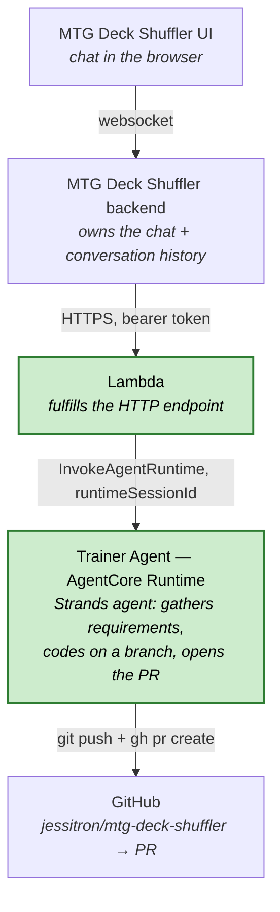

# small-coding-agent

A single-purpose coding agent on **Amazon Bedrock AgentCore Runtime**. It chats
with a human, implements a coding task on `jessitron/mtg-deck-shuffler`, and
opens a PR.

See [`design/architecture.md`](design/architecture.md) for the full design and
the invoke contract.

## Architecture

> 🟩 Green nodes (**Lambda** and **Trainer Agent**) are what lives in this repo.
> The rest are external systems we talk to.

| Hop | How |
| --- | --- |
| UI → backend | Websocket; the backend owns the chat UI and the conversation history. |
| backend → Lambda | HTTPS to an endpoint fulfilled by a Lambda, authenticated with a bearer token. |
| Lambda → Trainer Agent | `InvokeAgentRuntime`, once per user message, carrying a stable `runtimeSessionId`. |
| Trainer Agent → GitHub | Implements on a branch, then `git push` + `gh pr create`; the PR link flows back up the chain. |
